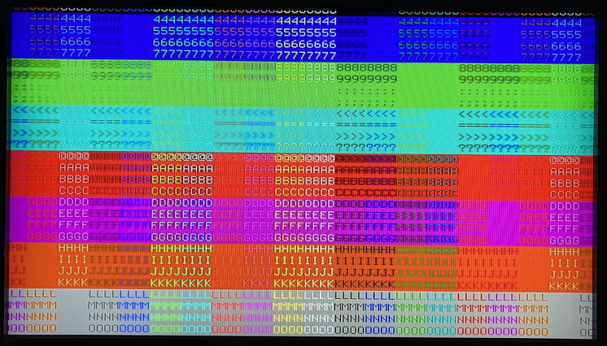

# XLR8 HDMI VGA Text Demo XB

An XLR8 XB which will run on the Alorium Technology Snō board and produce simple VGA text demo over HDMI

## Overview

This Xcelerator Block will run on the [Alorium Technology Snō](https://www.mouser.co.uk/ProductDetail/Alorium/SnoR20M16V3/?qs=sGAEpiMZZMve4%2FbfQkoj%252bCt7XfrcUv5s%2FrtyQWYQt6w=)
FPGA board and will produce simple VGA text demo over HDMI at 640x480 pixels (60Hz).

The Verilog for the HDMI video, audio and VGA text generator is a remix of the HDL Utils written by Sameer Puri:
- https://github.com/hdl-util
- https://github.com/hdl-util/hdmi-demo
- https://github.com/hdl-util/vga-text-mode
- https://github.com/hdl-util/sound
- https://github.com/hdl-util/hdmi

CLKDivider and DifferentialSignal are taken from the KAMAMI maXimator HDMI Test example by Michał Kozioł:
- https://maximator-fpga.org/examples/
- https://maximator-fpga.org/wp-content/uploads/2017/03/maXimator-HDMI-test.zip
- https://youtu.be/agKPjtTc7_g

Once you have programmed the Snō with the XLR8Build 'bootloader', the blue status LED (D13) will blink a heartbeat at 1Hz.

The [examples](./XLR8Build/examples) folder contains a very simple test .ino which will allow you to change the volume of the sawtooth sound.

## Resources

- https://www.aloriumtech.com/sno-quickstart/
- https://www.aloriumtech.com/documents/Sno_Pin_Map.pdf
- https://www.aloriumtech.com/sno-support/
- https://www.aloriumtech.com/openxlr8/
- https://www.aloriumtech.com/xcelerator-blocks/
- https://www.aloriumtech.com/webinars/

The _**Intro to OpenXLR8**_ webinar contains a _lot_ of useful information. You will need to watch that if you are using Snō and XBs for the first time.

## Connections

You will need a suitable HDMI Breakout or cable to connect the Snō pins to the HDMI port on your TV/Monitor, e.g.:
- https://www.mouser.co.uk/ProductDetail/Gravitech/HDMI-TERM?qs=fkzBJ5HM%252BdAarVr%2F6McOaQ%3D%3D

| Signal | HDMI Pin | Snō Pin |
|---|---|---|
| TMDS D2+ | 1 | D28 |
| TMDS D2S | 2 | GND |
| TMDS D2- | 3 | D34 |
| TMDS D1+ | 4 | D35 |
| TMDS D1S | 5 | GND |
| TMDS D1- | 6 | D22 |
| TMDS D0+ | 7 | D23 |
| TMDS D0S | 8 | GND |
| TMDS D0- | 9 | D29 |
| TMDS CLK+ | 10 | D30 |
| TMDS CLKS | 11 | GND |
| TMDS CLK- | 12 | D36 |
| Shield | | GND |

The Snō requires 3.3V power. Connecting it to 5V will damage it. Please make sure you are using one of the [recommended FTDI cables](https://www.aloriumtech.com/sno-quickstart/) to provide power for the board.

## LICENSE

Sameer Puri's HDL Utils are dually-licensed under the MIT and Apache 2.0 licenses

The parts written by Alorium Technology are licensed under the [MIT license](XLR8Build/LICENSE)

The parts written by Paul are licensed under the beerware license:
- _This code and connection guide is public domain but you buy me a beer if you use it and we meet someday_

Enjoy!

_**Paul**_
